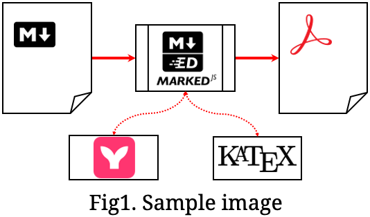
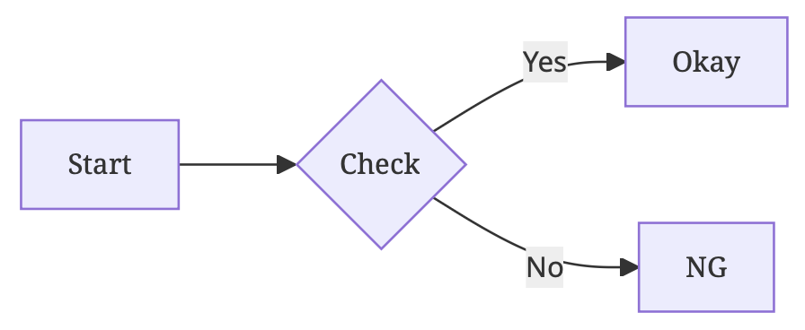
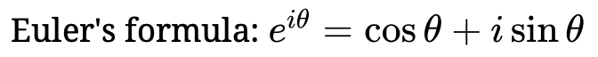

md2pdf - 印刷用にMarkdownをPDFに整形
====================================

[](https://github.com/jado4810/md2pdf/search?l=JavaScript)
[](https://github.com/jado4810/md2pdf/search?l=CSS)
[](https://github.com/nodejs)
[](https://github.com/docker)
[](https://github.com/jado4810/md2pdf/blob/main/LICENSE.txt)

[EN](./README.md)|JA

本ツールについて
----------------

MarkdownのPDFコンバーターです。
ドキュメントの出力に用いることを想定しています。

以下のとおり、紙媒体への出力を念頭に置いた書式を提供しています。

* 用紙サイズとして、A3・A4・A5もしくは北米のLetter・Legalの縦横に対応
* ページのヘッダー部にドキュメントのタイトルを出力(文書中にH1ヘッダーがあればそこから抽出)
* ページのフッター部にページ番号を出力(出力しない設定も可能)
* 日本語文書においてはユニバーサルデザインフォント(モリサワBIZ UD)を使用

以下のスタイルについてはカスタマイズが可能です。

* 言語設定(西欧・日本語・韓国語・中国語、自動推測可)
* 段落スタイル(インデントあり・段落間マージンあり)
* 色設定(カラー・グレイスケール・モノクロ)

対応しているMarkdownの書式は以下のとおりです。

* GitHub Flavored Markdown
* コードのハイライト
* Mermaid
* LaTeXによる数式

使い方
------

PDFは標準出力に吐き出されます。
出力リダイレクションを使用してファイルに保存してください。

入力ファイルを省略した場合や`-`を指定した場合は標準入力から読み込みます。

フォントデータなどの環境の準備にはそれなりに手間がかかることから、コンテナでの利用を推奨します。

### コンテナでの利用

ヘルパースクリプト`md2pdf.sh`を利用できます。

```console
$ ./md2pdf.sh [オプション] [入力ファイル] > 出力ファイル
```

以下のオプションを指定可能です。

* `-p 用紙サイズ`
    * 用紙サイズを指定します
    * 以下に対応しています
        * `a3`…A3縦 ・ `a3r`…A3横
        * `a4`…A4縦(デフォルト) ・ `a4r`…A4横
        * `a5`…A5縦 ・ `a5r`…A5横
        * `letter`…Letter(北米規格)縦 ・ `letterr`…Letter(北米規格)横
        * `legal`…Legal(北米規格)縦 ・ `legalr`…Legal(北米規格)横
* `-t タイトル`
    * ページのヘッダー部に出力する文書タイトルを指定します
    * 省略した場合、H1の見出しから抽出します
* `-n`
    * ページ番号の出力を抑止します
* `-r 倍率`
    * 画像データの縮小率をパーセント単位で指定します
    * SVG画像には適用されません
    * PDF上にくっきりとした画像を出すために、拡大設定を行った画面上でスクリーンショットを取り、100より小さい値を指定することを推奨します
* `-l ロケール` **(Ver.0.6で仕様変更、Ver.0.8でデフォルト値変更)**
    * テキストの言語および国をロケールとして指定します
    * フォントやインデントの書式、および改行時禁則文字やハイフネーション規則に影響します
    * 省略した場合、実際の入力から推測します
    * 設定例は以下の通りです
        * `en`…英語用
        * `ja`…日本語用
        * `ko`…韓国語用
        * `zh-cn`…簡体字中国語用
        * `zh-tw`…繁体字中国語用
* `-i`
    * 各段落にインデントを付けず、段落間にマージンを設けます
* `-c 色設定`
    * 色設定を指定します
    * 以下に対応しています
        * `color`…カラー(デフォルト)
        * `grayscale`…グレースケール ※中間調ありの白黒
        * `monochrome`…モノクローム ※白と黒のみの配色
* `-a`
    * 見出しの項目名とアンカーIDの一覧を出力します
    * 見出しへの内部リンクを張るために使用するものです
* `-q`
    * コンソールへの各種情報の出力を抑止します
    * 指定した場合、`-a`オプションは意味を持たなくなります

このスクリプトは、内部で以下のdocker runコマンドを呼び出します。

```console
$ docker run --rm -i -v ベースディレクトリー:/opt/app/mnt md2pdf node md2pdf.js -b /opt/app/mnt オプション 入力ファイル
```

* 入力ファイルのパス(標準入力の場合は`$PWD`)を抽出し、ボリュームマウントを実施
* マウント先をベースディレクトリーとして指定することで、ベースディレクトリーからの相対パスとしてリソースを参照可能とする

### NodeJSの直接実行

ヘッドレスモードに対応したWEBブラウザーと、適切なフォントデータがインストールされている環境下であれば、ローカルのNodeJS環境で直接実行することが可能です。

```console
$ node md2pdf.js [オプション] [入力ファイル] > 出力ファイル
```

コンテナ利用におけるヘルパースクリプトに指定できるオプションに加えて、リソースを相対パスで参照する際のベースディレクトリーを`-b`オプションで指定できます。

準備
----

### コンテナでの利用

ヘッドレスブラウザードライバーであるPuppeteerをコンテナ内で動作させるには、かなり厳しい基準がありますが、Intel Linux環境およびARM macOS環境において動作することを確認済みです。

```console
$ docker build -t md2pdf .
```

上記にて、Debianの公式パッケージとして供給されているオープンソースのWEBブラウザーコンポーネントであるChromiumを用いてコンテナイメージが作成されます。

### NodeJSの直接実行

NodeJS環境で直接実行する場合、まず必要なライブラリーをインストールしてください。

```console
$ npm install
```

他に、Google ChromeやMicrosoft Edgeなどの、ヘッドレスモードに対応したWEBブラウザーが必要です。

Markdownフォーマット
--------------------

Markdown文書は[MarkedJS](https://marked.js.org/)で整形されます。

この際、[GitHub Flavored Markdown](https://docs.github.com/ja/get-started/writing-on-github/getting-started-with-writing-and-formatting-on-github/basic-writing-and-formatting-syntax)として解釈されますが、加えて以下の拡張を行っています。

### 1\. 見出しのアンカー

見出し項目には、見出し内容の文字列をGitHubと同じ方法で「スラッグ化」することで生成されたアンカーIDが付与されます。

IDは内部リンクを行う際に有用です。
`-a`オプションを付与することで、リンクに用いるスラッグ化したIDを表示できます。

### 2\. 図の見出し

タイトルを付けた画像は、`figurecaption`要素にタイトルの内容を持たせた`figure`要素として整形されます。

例えば、以下のようなタイトル付きの画像は、

```markdown

```

このように整形されます。

<p align="center">

</p>

`-r`オプションを指定することで図をくっきりと出すことができます。

### 3\. コードブロック

#### 3.1. ハイライト

コードブロックの開始部に付与した言語指定子は[highlight.js](https://highlightjs.org/)によってコードの強調に用いられます。
言語指定子の後に、コロンで区切ってファイル名を追加することも可能です。

````markdown
```javascript:sample.js
function highlight(code, lang) {
  try {
    code = hljs.highlight(code, {language: lang}).value;
  } catch (e) {
    console.error('Error: ', e);
  }
  return code;
}
```
````

は、以下のように整形されます。

<p align="center">

</p>

#### 3.2. Mermaid

言語指定子として"mermaid"を付与したコードブロックは[MermaidJS](https://mermaid.js.org/)で描画されます。

例えば、以下のようなコードブロックは、

````markdown

````

このように描画されます。

<p align="center">

</p>

#### 3.3. 見出し

言語指定子の後に、ダブルクォーテーションで囲んだ見出しを追加することが可能です。

一般的なMarkdownパーサーが混乱しないよう、コードブロックの開始部および言語指定子との間にスペースを挟むことを推奨します。

見出しはMermaidブロックにも指定可能です。

````markdown
```javascript:sample.js "List 1. highlight sample"
function highlight(code, lang) {
  try {
    code = hljs.highlight(code, {language: lang}).value;
  } catch (e) {
    console.error('Error: ', e);
  }
  return code;
}
```
````

は、以下のように整形されます。

<p align="center">

</p>

#### 3.4. ページング制御

言語指定子の後に、`[`〜`]`で囲んだページング制御指示を追加することが可能です。

一般的なMarkdownパーサーが混乱しないよう、コードブロックの開始部および言語指定子との間にスペースを挟むことを推奨します。

ページング制御指示として、以下を指定可能です。

* `flow`

    これを指定したコードブロックは、ブロック中での改ページを許容し、指定した場所にそのまま出力されます。
    デフォルトでは、コードブロック中での改ページを避けるため、ページの残りスペースより長いコードブロックがある場合、直前で改ページが行われますが、`flow`を指定したコードブロックでは、直前での改ページが行われません。

* `newpage`

    これを指定したコードブロックは、直前で強制的に改ページが行われるため、常に新しいページの先頭に出力されます。

* `isolated`

    これを指定したコードブロックは、`newpage`指定時のような直前だけでなく直後でも強制改ページが行われるため、常に独立したページに出力されます。

例えば、以下のようなコードブロックは、コードブロックだけを含む独立したページに出力されます。

````markdown
```javascript:long.js [isolated]
function long_proc(list) {
  var a = 1;
  var b = 2;

  return list.forEach(function(elem) {
    elem.someProcs(a);
    elem.someProcs(b);
    // (以下、長い処理が続く)
    //  :
    //  :
    //  :
  });
}
```
````

### 4\. LaTeX

`$`〜`$`または`$$`〜`$$`で囲んだLaTeXの数式記述は、[KaTeX](https://katex.org/)で描画されます。
`$`〜`$`で囲んだ部分はインライン数式として、`$$`〜`$$`で囲んだ部分はブロック数式として、それぞれ描画されます。

例えば、以下のようなインライン数式は、

```markdown
Euler's formula: $e^{i\theta}=\cos\theta+i\sin\theta$
```

このように描画されます。

<p align="center">

</p>

また、以下のようなブロック数式は、

```markdown
$$
ax^2+bx+c=0 \\
\Leftrightarrow x = \frac{-b\pm\sqrt{b^2-4ac}}{2a}
$$
```

このように描画されます。

<p align="center">

</p>

著作権およびライセンス
----------------------

Copyright (c)2023-2025 Shun-ichi TAHARA &lt;jado@flowernet.jp&gt;

[MITライセンス](./LICENSE.txt)で提供します。
例外として、[third-party/getoptions](./third-party/getoptions/)ディレクトリー以下は、[ko1nksm/getoptions](https://github.com/ko1nksm/getoptions)の成果物を流用したものであるため、[CC0](./third-party/getoptions/LICENSE)が適用されます。
