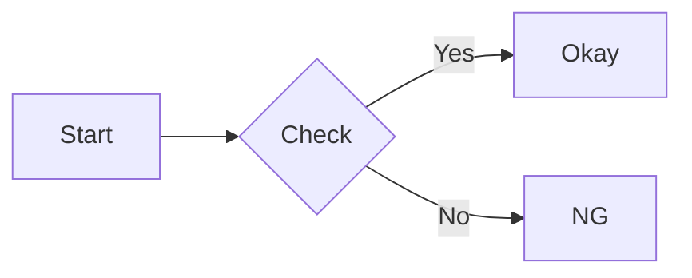

md2pdf - Typeset Markdown to PDF for publishing
===============================================

What is this?
-------------

Tiny PDF converter for Markdown, assumed for use in exporting documents.

So the style is built with consciousness of single-column articles in academic journals:

* A4 portrait
* Header with the document title (Auto extraction from H1 header)
* Footer with the page number
* Japanese universal-design fonts (Morisawa BIZ UD)

We provide it with those built-in fixed style for now, but considering to be customizable in some days.
Of course you can modify the style and rebuild it ;)

It accepts Markdown format like below:

* Marked-recognizable formats
* Mermaid
* Code highlight

How to Use
----------

In any case, you can get output PDF from stdout.
So remind using output redirection to get a result file.

Input file can be omitted or be specified `-`, to read input from stdin.

### Direct-run NodeJS

```console
$ node md2pdf.js [input] > output
```

### Run as a container

```console
$ docker run --rm -i -v «dir»:/opt/app/mnt md2pdf:«ver» node md2pdf.js -b /opt/app/mnt [input] > output
```

* Mount volume on local filesystem and specify `-b` option
* Input file must be relative from `dir`

Helper script `md2pdf.sh` is available.

```console
$ ./md2pdf.sh [input] > output
```

Preparation
-----------

### Direct-run NodeJS

If you use NodeJS directly, install required libraries first.

```console
$ npm install
```

Also needs a web browser installed, which is compatible with "headless mode",
i.e. Google Chrome, Microsoft Edge.

### Run as a container

Alternatively, you can use it as a docker container.
It has severe criteria related to headless browser, however we have confirmed to be available on Intel Linux and ARM macOS.

```console
$ docker build -t md2pdf .
```

Markdown format
---------------

Markdown documents will be rendered by [marked](https://marked.js.org/).

In addition, we provide the following extensions.

### Mermaid

Code blocks with the language specifier of "mermaid" will be rendered by [mermaidjs](https://mermaid.js.org/).

For example, code block below:

```
`​`​`mermaid
flowchart LR
  A[Start]-->B{Check}
  B-->|Yes| C
  B-->|No| D
  C[Okay]
  D[NG]
`​`​`
```

will be rendered as:



### Code highlight

Language specifier following code block openers are passed to [highlight.js](https://highlightjs.org/)

```
`​`​`javascript
function highlight(code, lang) {
  try {
    code = hljs.highlight(code, {language: lang}).value;
  } catch (e) {
    console.error('Error: ', e);
  }
  return code;
}
`​`​`
```

will be:

```javascript
function highlight(code, lang) {
  try {
    code = hljs.highlight(code, {language: lang}).value;
  } catch (e) {
    console.error('Error: ', e);
  }
  return code;
}
```

### Paging control

Language specifier can be prefixed by paging control keyword.

To specify both paging control and language, separate them with '`:`'.

The following controls are available:

* `flow`
  Allows this code block paging inside the block;
  pagings are avoided inside it as a default,
  so breaks page before long code block.
  But `flow`ed blocks will not break pages before it.
* `newpage`
  Makes sure break page just before this code block.
* `isolated`
  In addition to `newpage`, also breaks page just after this code block.
