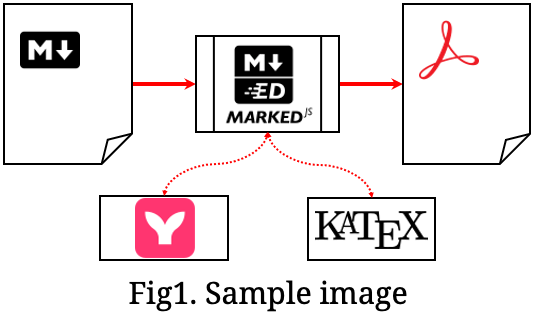
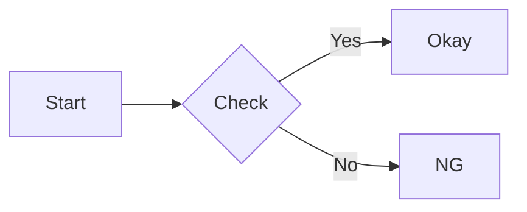
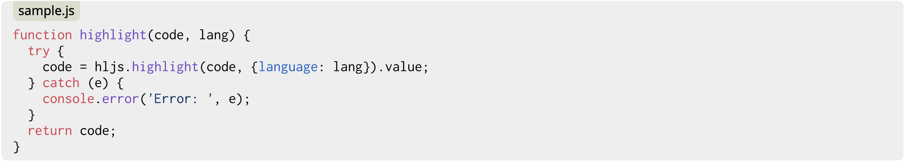
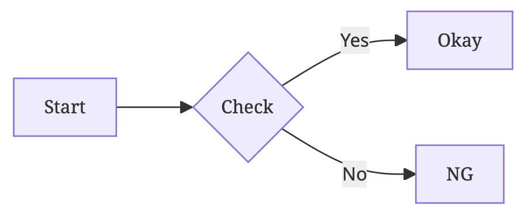
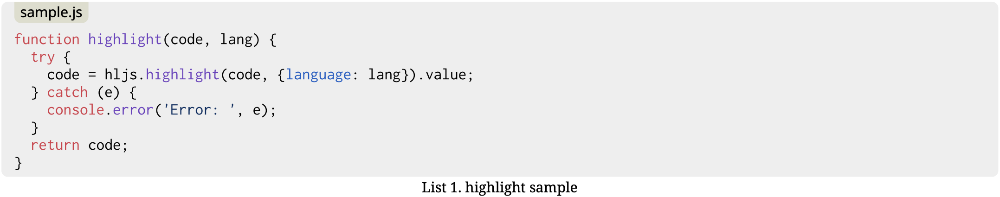

md2pdf - Typeset Markdown to PDF for publishing
===============================================

What is this?
-------------

Tiny PDF converter for Markdown, assumed for use in exporting documents.

So the style is built with consciousness of single-column articles in academic journals:

* A4 portrait
* Header with the document title (Auto extraction from H1 header available)
* Footer with the page number
* For Japanese, with universal-design fonts (Morisawa BIZ UD)

Some styles are customizable:

* Color scheme (color, grayscale, monochrome)
* Language scheme (Latin, Japanese)

And considering of others to be customizable in some days.
Of course you can modify the style and rebuild it ;)

It accepts Markdown format like below:

* Marked-recognizable formats
* Mermaid
* Code highlight

How to Use
----------

You can get output PDF from stdout.
So remind using output redirection to get a result file.

Input file can be omitted or be specified `-`, to read input from stdin.

Considering of preparing environments like font files, we recommend to run as a container.

### Run as a container

Helper script `md2pdf.sh` is available.

```console
$ ./md2pdf.sh [options] [input] > output
```

Options are available below:

* `-t «title»`
    * Specify the document title to be printed on the page header
    * If omitted, attempt to extract from H1 header
* `-r «ratio»`
    * Specify the img magnify ratio in percentage
    * Recommended smaller (< 100) value on screenshots from zoomed screen to get clear images in PDF
* `-l «lang»`
    * Speciry the language scheme, to set some styles: fonts and indentation rules
    * Available below for now:
        * `latin` (default) - For most european languages
        * `ja` - For Japanese, use BIZ UD fonts and paragraph indentation
* `-c «color»`
    * Specify the color scheme
    * Available below for now:
        * `color` (default)
        * `grayscale`
        * `monochrome`

This script calls docker run like below:

```console
$ docker run --rm -i -v «dir»:/opt/app/mnt md2pdf node md2pdf.js -b /opt/app/mnt «options» «input»
```

* Extract base directory from input file path (or `$PWD`) and mount volume
* Pass base directory to be extracted directory (or `$PWD`), so any resources are refered relative from the base directory

### Direct-run NodeJS

Required web browser compatible with "headless mode" and proper fonts to be installed, and you can run it on the local NodeJS environment.

```console
$ node md2pdf.js [options] [input] > output
```

You can append `-b` option to specify the base path for resources.

Preparation
-----------

### Run as a container

There is pretty severe criteria to run puppeteer, a headless browser driver, in the container.
However we have confirmed to be available on Intel Linux and ARM macOS.

```console
$ docker build -t md2pdf .
```

### Direct-run NodeJS

If you want to run NodeJS directly, install required libraries first.

```console
$ npm install
```

Also needs a web browser installed, which is compatible with "headless mode",
i.e. Google Chrome, Microsoft Edge.

Markdown format
---------------

Markdown documents will be rendered by [marked](https://marked.js.org/).

In addition, we provide the following extensions.

### Figure with caption

Images with title will be rendered as `figure` elements with `figurecaption` holding those titles.

For example, titled image below:

```

```

will be rendered as:

<p align="center">

</p>

Also consider specifying the `-r` options.

### Mermaid

Code blocks with the language specifiers of "mermaid" will be rendered by [mermaidjs](https://mermaid.js.org/).

For example, code block below:

````

````

will be rendered as:

<p align="center">

</p>

### Code highlight

Language specifiers following code block openers are passed to [highlight.js](https://highlightjs.org/).
And additional filenames separated by colon are also available.

````
```javascript:sample.js
function highlight(code, lang) {
  try {
    code = hljs.highlight(code, {language: lang}).value;
  } catch (e) {
    console.error('Error: ', e);
  }
  return code;
}
```
````

will be:

<p align="center">

</p>

### Caption for code block (and mermaid)

Language specifiers can be followed by captions enclosed in double quotations.

Note that spaces are required after code block openers and language specifiers to avoid confusing common markdown parsers.

Captions are available also on mermaid blocks.

````
```javascript:sample.js "List 1. highlight sample"
function highlight(code, lang) {
  try {
    code = hljs.highlight(code, {language: lang}).value;
  } catch (e) {
    console.error('Error: ', e);
  }
  return code;
}
```
````

will be:

<p align="center">

</p>

### Paging control

Language specifiers can be followed by paging control specifications enclosed in brackets.

Note that spaces are required after code block openers and language specifiers to avoid confusing common markdown parsers.

The following controls are available:

* `flow`
  Allows this code block paging inside the block;
  pagings are avoided inside it as a default,
  so breaks page before long code block.
  But `flow`ed blocks will not break pages before it.
* `newpage`
  Makes sure break page just before this code block.
* `isolated`
  In addition to `newpage`, also breaks page just after this code block.

For example, the list below will be rendered in separate page.

````
```javascript:long.js [isolated]
function long_proc(list) {
  var a = 1;
  var b = 2;

  return list.forEach(function(elem) {
    elem.someProcs(a);
    elem.someProcs(b);
    // other long procs...
    // :
    // :
    // :
  });
}
```
````

Copyright and License
---------------------

Copyright (c)2023-2024 Shun-ichi TAHARA <jado@flowernet.jp>

Provided under MIT License, with the exception of getoptions directory,
which is appropriated from ko1nksm's work provided under CC0 at
https://github.com/ko1nksm/getoptions .
