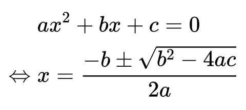

md2pdf - Typeset Markdown to PDF for publishing
===============================================

[](https://github.com/nodejs)
[](https://github.com/docker)
[](https://github.com/jado4810/md2pdf/search?l=JavaScript)
[](https://github.com/jado4810/md2pdf/blob/main/LICENSE.txt)

What is this?
-------------

The PDF converter for Markdown, assumed for use in exporting documents.

Those style is built with consciousness of paper prints:

* A3, A4, A5, letter or legal, portrait or landscape
* Header with the document title (Auto extraction from H1 header available)
* Footer with the page number (Can be omitted)
* For Japanese, with universal-design fonts (Morisawa BIZ UD)

Some kinds of the style are customizable:

* Language scheme (Latin, Japanese, Korean, Chinese)
* Paragraph stye (indented, gapped)
* Color scheme (color, grayscale, monochrome)

It accepts Markdown format like below:

* GitHub Flavored Markdown
* Code highlight
* Mermaid
* Math formula with LaTeX

How to Use
----------

You can get output PDF from stdout.
So remind using output redirection to get a result file.

Input file can be omitted or be specified `-`, to read input from stdin.

Considering of preparing environments like font files, we recommend to run as a container.

### Run as a container

Helper script `md2pdf.sh` is available.

```console
$ ./md2pdf.sh [o̲p̲t̲i̲o̲n̲s̲] [i̲n̲p̲u̲t̲] > o̲u̲t̲p̲u̲t̲
```

Options are available below:

* `-p p̲a̲p̲e̲r̲`
    * Specify the paper size
    * Available below:
        * `a3` - ISO A3 portrait, `a3r` - ISO A3 landscape
        * `a4` - ISO A4 portrait (default), `a4r` - ISO A4 landscape
        * `a5` - ISO A5 portrait, `a5r` - ISO A5 landscape
        * `letter` - US letter portrait, `letterr` -  US letter landscape
        * `legal` - US legal portrait, `legalr` - US legal landscape
* `-t t̲i̲t̲l̲e̲`
    * Specify the document title to be printed on the page header
    * If omitted, attempt to extract from H1 heading
* `-n`
    * Omit page numbers
* `-r r̲a̲t̲i̲o̲`
    * Specify the img magnify ratio in percentage
    * No effect on SVG image
    * Recommended smaller (< 100) value on screenshots from zoomed screen to get clear images in PDF
* `-l l̲a̲n̲g̲`
    * Speciry the language scheme, to decide font priorities, line break rules and text indentation rules
    * Available below:
        * `latin` - For most european languages (default)
        * `ja` - For Japanese
        * `ko` - For Korean
        * `cn` - For Simplified Chinese
        * `tw` - For Traditional Chinese
* `-i`
    * Omit paragraph indentation and make gaps between paragraphs
* `-c c̲o̲l̲o̲r̲`
    * Specify the color scheme
    * Available below:
        * `color` (default)
        * `grayscale`
        * `monochrome`
* `-a`
    * Show anchor ids and texts of headings
    * Useful for making internal links to the headings

This script calls docker run like below:

```console
$ docker run --rm -i -v d̲i̲r̲:/opt/app/mnt md2pdf node md2pdf.js -b /opt/app/mnt o̲p̲t̲i̲o̲n̲s̲ i̲n̲p̲u̲t̲
```

* Extract base directory from input file path (or `$PWD`) and mount volume
* Pass base directory to be the mount point, so any resources are refered relative from the base directory

### Direct-run NodeJS

Required web browser compatible with "headless mode" and proper fonts to be installed, and you can run it on the local NodeJS environment.

```console
$ node md2pdf.js [o̲p̲t̲i̲o̲n̲s̲] [i̲n̲p̲u̲t̲] > o̲u̲t̲p̲u̲t̲
```

You can append `-b` option to specify the base path for resources.

Preparation
-----------

### Run as a container

There is pretty severe criteria to run puppeteer, a headless browser driver, in the container.
However we have confirmed to be available on Intel Linux and ARM macOS.

```console
$ docker build -t md2pdf .
```

The container image will be built with Chromium, an open source web browser component, introduced from the official debian package.

### Direct-run NodeJS

If you want to run NodeJS directly, install required libraries first.

```console
$ npm install
```

Also needs a web browser installed, which is compatible with "headless mode", i.e. Google Chrome, Microsoft Edge.

Markdown format
---------------

Markdown documents are rendered by [MarkedJS](https://marked.js.org/), and are recognized as [GitHub Flavored Markdown](https://docs.github.com/en/get-started/writing-on-github/getting-started-with-writing-and-formatting-on-github/basic-writing-and-formatting-syntax).

In addition, the following extensions are provided.

### 1\. Anchor of heading

Headings are given anchor ids, which are generated by "slugifying" those header texts in the same way as GitHub.

Those ids are useful for making internal links.
Consider specifying the `-a` option to make visible slugified ids to link.

### 2\. Figure with caption

Images with titles are rendered as `figure` elements with `figurecaption` holding those titles.

For example, titled image below:

```

```

will be rendered as:

<p align="center">

</p>

Also consider specifying the `-r` option to get clear images.

### 3\. Code block

#### 3.1. Highlight

Language specifiers following code block openers are passed to [highlight.js](https://highlightjs.org/).
And additional filenames separated by colon are also available.

````
```javascript:sample.js
function highlight(code, lang) {
  try {
    code = hljs.highlight(code, {language: lang}).value;
  } catch (e) {
    console.error('Error: ', e);
  }
  return code;
}
```
````

will be:

<p align="center">

</p>

#### 3.2. Mermaid

Code blocks with the language specifiers of "mermaid" are rendered by [MermaidJS](https://mermaid.js.org/).

For example, code block below:

````

````

will be rendered as:

<p align="center">

</p>

#### 3.3. Caption

Language specifiers can be followed by captions enclosed in double quotations.

Note that spaces are required after code block openers and language specifiers to avoid confusing common markdown parsers.

Captions are available also on mermaid blocks.

````
```javascript:sample.js "List 1. highlight sample"
function highlight(code, lang) {
  try {
    code = hljs.highlight(code, {language: lang}).value;
  } catch (e) {
    console.error('Error: ', e);
  }
  return code;
}
```
````

will be:

<p align="center">

</p>

#### 3.4. Paging control

Language specifiers can be followed by paging control specifications enclosed in brackets.

Note that spaces are required after code block openers and language specifiers to avoid confusing common markdown parsers.

The following controls are available:

* `flow`

    Allows this code block paging inside the block; pagings are avoided inside it as a default, so breaks page before long code block.
    But `flow`ed blocks do not break pages before it.

* `newpage`

    Makes sure break page just before this code block.

* `isolated`

    In addition to `newpage`, also breaks page just after this code block.

For example, the list below will be rendered in separate page.

````
```javascript:long.js [isolated]
function long_proc(list) {
  var a = 1;
  var b = 2;

  return list.forEach(function(elem) {
    elem.someProcs(a);
    elem.someProcs(b);
    // other long procs...
    // :
    // :
    // :
  });
}
```
````

### 4\. LaTeX

LaTeX formulas surrounded by `$` or `$$` are passed to [KaTeX](https://katex.org/).
The parts surrounded by `$` are rendered as inline formulas, and those by `$$` as block ones.

For example, the inline formula below:

```
Euler's formula: $e^{i\theta}=\cos\theta+i\sin\theta$
```

will be rendered as:

<p align="center">

</p>

And the block formula below:

```
$$
ax^2+bx+c=0 \\
\Leftrightarrow x = \frac{-b\pm\sqrt{b^2-4ac}}{2a}
$$
```

will be:

<p align="center">

</p>

Copyright and License
---------------------

Copyright (c)2023-2024 Shun-ichi TAHARA &lt;jado@flowernet.jp&gt;

Provided under [MIT license](./LICENSE.txt), with the exception of [third-party/getoptions](./third-party/getoptions/) directory, which is appropriated from [ko1nksm/getoptions](https://github.com/ko1nksm/getoptions) of [CC0](./third-party/getoptions/LICENSE).
